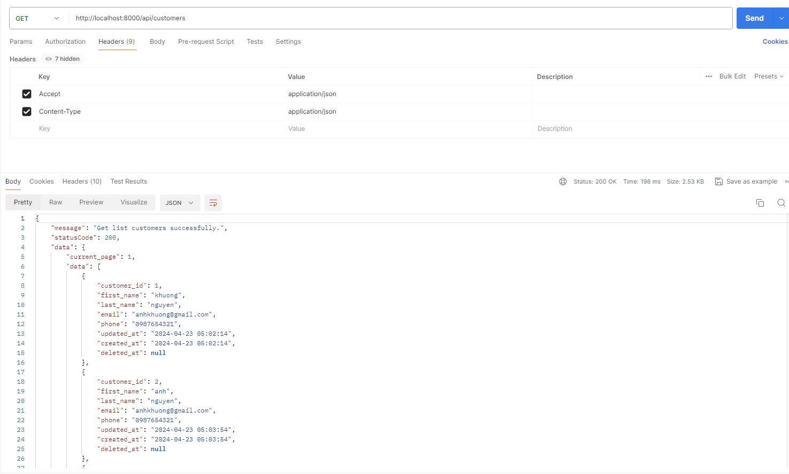

### Tasks
- There should be API routes that allow them to:
- Create a new bank account for a customer, with an initial deposit amount. A
    single customer may have multiple bank accounts.
- Transfer amounts between any two accounts, including those owned by
    different customers.
- Retrieve balances for a given account.
- Retrieve transfer history for a given account.

### The assessment will require completion of 5 components (code required):
1. Database Diagram Structure (Done)
2. Detailed Class diagrams (Done)
3. Implementation of API endpoints for the specified functionalities. (Done)
4. Development of a web interface interacting with the APIs: Utilize HTML5, Pure CSS3 Responsive Design (with meticulous attention to Perfect Pixel), and JavaScript. (Done)
5. Rigorous unit testing with code coverage exceeding or equal to 70%. (Not completed, but i have checked it through Postman, and it have worked normally.)

## Submission
### Database diagram and class diagram
1. Database diagram.

    

2. Class diagram.

    

### Images of the website and testing on postman.
1. List customers page.

    

2. New customers page.

    

3. List accounts page.

    

4. Account detail page.

    

5. List transactions page.

    

6. Testing on Postman

    
    
    
    
    
    
    
    

    

